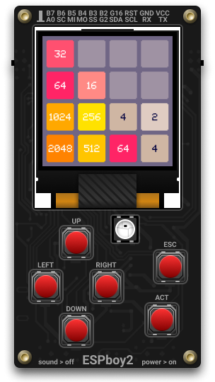

# 2048 Game

Here is a remake of the famous 2048 game for the ESPboy.

2048 is a single-player sliding tile puzzle game written by Italian web developer Gabriele Cirulli. The game's objective is to slide numbered tiles on a grid to combine them to create a tile with the number 2048. However, one can continue to play the game after reaching the goal, creating tiles with higher numbers.

The original 2048 game [was published on GitHub][2048] under MIT license in March 2014.  
You can [play it online][game].

On your ESPboy, use the directional buttons to drag the tiles in the desired direction and the **[ACT]** button to (re)start the game.

The source code relies on:

- [ESPboy Library][espboy] (handheld driver)
- [LovyanGFX Library][lovyangfx] (graphics driver)

## Quick installation on your ESPboy

You can easily install and test the 2048 game on your ESPboy right away (without having to compile the project) using online [ESPboy Flasher][flasher]. This tool is only supported by Google Chrome and Microsoft Edge.

[2048]:      https://github.com/gabrielecirulli/2048
[game]:      https://play2048.co/
[espboy]:    https://m1cr0lab-espboy.github.io/ESPboy
[lovyangfx]: https://github.com/lovyan03/LovyanGFX/
[flasher]:   https://m1cr0lab-espboy.github.io/2048/